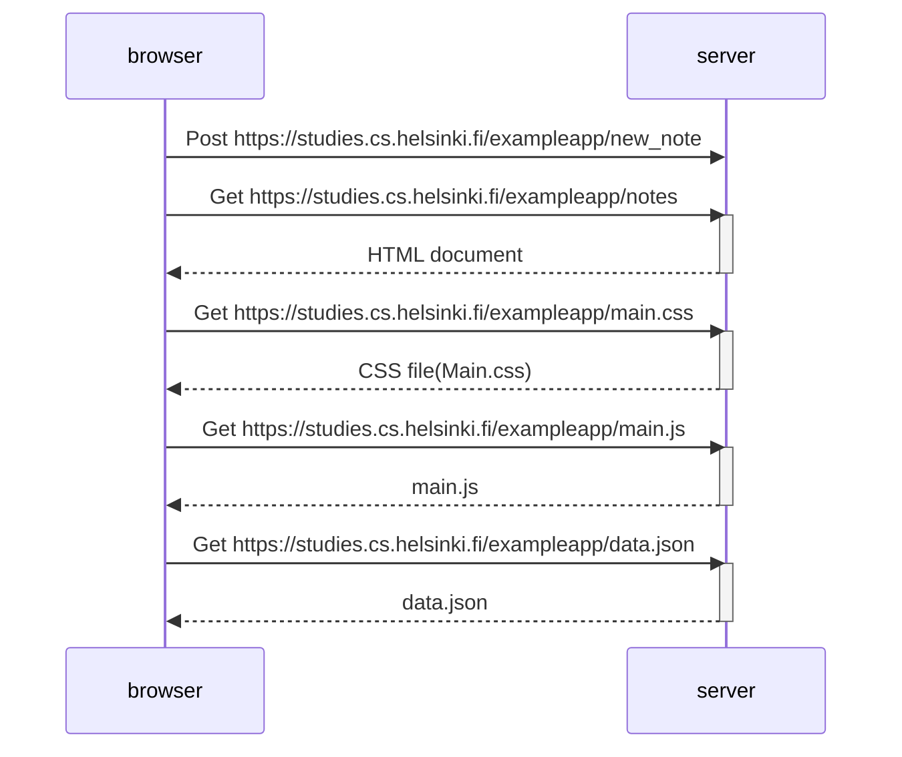

<!-- @format -->

```mermaid
sequenceDiagram
participant browser
participant server

browser->>server: Post https://studies.cs.helsinki.fi/exampleapp/new_note
browser->>server: Get https://studies.cs.helsinki.fi/exampleapp/notes
activate server
server-->>browser: HTML document
deactivate server

browser->>server: Get https://studies.cs.helsinki.fi/exampleapp/main.css
activate server
server-->>browser: CSS file(Main.css)
deactivate server

browser->>server: Get https://studies.cs.helsinki.fi/exampleapp/main.js
activate server
server-->>browser: main.js
deactivate server

browser->>server: Get https://studies.cs.helsinki.fi/exampleapp/data.json
activate server
server-->>browser: data.json
deactivate server
```
